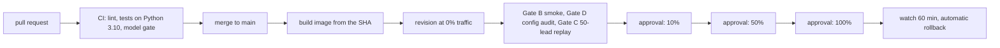

# bringdata

Lead scoring in production for a Brazilian online school (DevClub). Each lead that
signs up for a launch gets a purchase-propensity score and a decile from a Random
Forest, and the decile drives what happens next: the conversion events sent to
Meta (CAPI) and Google Ads, the budget ceiling per creative, and the daily reports
the traffic team reads.

The repository holds the whole loop: ingestion, training, the scoring API, the
event senders, monitoring, and the CI/CD that ships it.

## What runs

| Piece | Where | What it does |
|---|---|---|
| Scoring API | Cloud Run service `smart-ads-api` (FastAPI, Python 3.10) | scores leads as they arrive, writes the ledger, sends CAPI and Google Ads events |
| Monitoring and webhook | Cloud Run services on the same image | daily checks, feature validation, alerts, Hotmart and SendFlow webhooks |
| Ingestion and reports | 17 Cloud Run jobs on Cloud Scheduler | leads, sales, ad spend, ad insights, launch calendar, Meta audiences, model performance report |
| Model registry | MLflow on Cloud SQL, artifacts in a GCS bucket | every training run, its metrics, its model card |
| Data | Cloud SQL (Postgres) | the ledger (`registros_ml`) and the `analytics` schema |

Two models run side by side in an A/B (champion and challenger); the active run ids
live in `V2/configs/active_models/devclub.yaml` and the image is built with exactly
those artifacts.

## Repository layout

```
V2/api        FastAPI service, deploy scripts, Dockerfile
V2/src        data processing, model training, monitoring, validation
V2/scripts    Cloud Run job entrypoints, deploy gates, CI checks
V2/configs    active models, client config, thresholds (YAML)
V2/tests      pytest suite (runs without credentials)
V2/docs       operational docs, safeguard plan, model changelog, reports
.github       CI and deploy workflows, Dependabot scope
infra         Terraform for the CI identity and the GitHub settings
```

## How a change reaches production



- **CI on every PR** (`.github/workflows/ci.yml`): ruff with the error-only rule set,
  the full test suite without any secret, and, when the PR changes the active model,
  a gate that reads the run in MLflow and checks its metrics, its git state and its
  artifacts.
- **Deploy on merge** (`.github/workflows/deploy.yml`): the runner authenticates to
  GCP through Workload Identity Federation (no key files), builds the image from
  scratch, pushes it, and creates a Cloud Run revision with no traffic. Three gates
  then run against that revision: a smoke test, an audit of the YAML inside the
  image, and a replay of 50 real leads that must return the same score and decile
  as the live revision.
- **Progressive delivery**: traffic moves in steps of 10, 50 and 100 percent. Each
  step waits for a human approval in a GitHub environment, runs the progression gate
  (feature report, CAPI deciles, 5xx rate), moves the traffic, and runs the smoke
  again. A bad verdict or a failed smoke restores the previous revision by itself.
- **After 100%**: a watcher polls the new revision for an hour and rolls back on a
  feature-validation error or a 5xx rate above 1%.
- **Guardrails around all of it**: one deploy at a time (lock in GCS), the deploy
  only ships the top of `main`, every deploy and promotion is written to a ledger
  with author and time, and the monitoring and webhook services are kept on the
  same image as the API.

The same gatekeeper runs from a laptop with `bash V2/api/deploy-gate.sh`; the
workflow only changes who calls it. Details in `V2/docs/DEPLOY_GATEKEEPER.md` and
`V2/docs/PLANO_SAFEGUARD.md`.

## Changing the model

A retrain produces an MLflow run and a model card. Promoting it is a pull request
that changes the run id in the active-model YAML, opened by
`V2/scripts/abrir_pr_modelo.sh <run_id>`. CI refuses the PR if the run does not
exist, if it was trained from a dirty working tree, if its artifacts are missing
from the bucket, or if its metrics fall below the thresholds in
`V2/configs/retreino_mensal.yaml`. The history is in `V2/docs/MODEL_CHANGELOG.md`.

## Running the tests

```bash
cd V2
pip install -r requirements-dev.txt
pytest
```

The suite runs without a `.env`. Tests that need the model artifacts skip when the
artifacts are absent; to run them, authenticate to GCP and fetch the artifacts of
the active runs with `bash scripts/baixar_artefatos_modelo.sh`.

## Automatic review

Every pull request from this repository gets a second reader: `.github/workflows/revisao.yml`
runs Claude Code over the diff and comments what it would change before merging (logic
defects, unhandled error paths, secrets in clear text, missing tests). It does not block
the merge; the branch protection only requires the CI checks. It needs one of two
repository secrets: `CLAUDE_CODE_OAUTH_TOKEN` (from `claude setup-token`, uses the
Claude plan quota) or `ANTHROPIC_API_KEY` (billed per token). Without either, the job
skips in seconds.

## Data and secrets

No lead data and no credential is tracked. Secrets live in Google Secret Manager
and reach the services as environment variables at deploy time. The CI identity is
a dedicated service account that GitHub assumes through OIDC, limited to this
repository.
