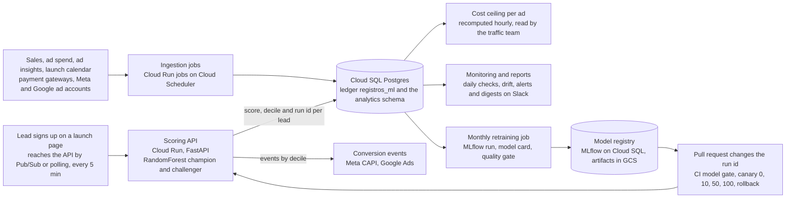
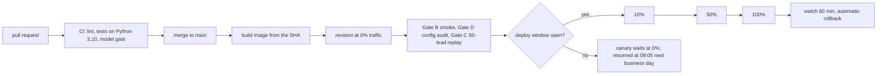

# bringdata

[](https://github.com/ramonfilho/bringdata/actions/workflows/deploy.yml)  [](LICENSE)

Lead scoring in production for a Brazilian online school (DevClub). Each lead that
signs up for a launch gets a purchase-propensity score and a decile from a Random
Forest, and the decile drives what happens next: the conversion events sent to
Meta (CAPI) and Google Ads, the budget ceiling per creative, and the daily reports
the traffic team reads.

The repository holds the whole loop: ingestion, training, the scoring API, the
event senders, monitoring, and the CI/CD that ships it.

## How the pieces connect



Read it left to right: a lead comes in and leaves with a score; the outcomes (sales,
spend) come back through the ingestion jobs; the same database feeds the ceiling, the
monitoring and the retraining; and a new model only reaches the API through a pull
request, the gates and the canary.

## What runs

| Piece | Where | What it does |
|---|---|---|
| Scoring API | Cloud Run service `smart-ads-api` (FastAPI, Python 3.10) | scores leads as they arrive, writes the ledger, sends CAPI and Google Ads events |
| Monitoring and webhook | Cloud Run services on the same image | daily checks, feature validation, alerts, Hotmart and SendFlow webhooks |
| Ingestion, reports and retraining | 18 Cloud Run jobs, fired by Cloud Scheduler | leads, sales, ad spend, ad insights, launch calendar, Meta audiences, model performance report, monthly retraining |
| Model registry | MLflow on Cloud SQL, artifacts in a GCS bucket | every training run, its metrics, its model card |
| Data | Cloud SQL (Postgres) | the ledger (`registros_ml`) and the `analytics` schema |

Two models run side by side in an A/B (champion and challenger); the active run ids
live in `V2/configs/active_models/devclub.yaml` and the image is built with exactly
those artifacts.

What the decile drives today: the Meta event goes out only for leads in tiers 8 to 10
and carries no monetary value (Meta uses it to find similar people); a value-per-decile
event ran for a short window in 2026 and no campaign optimizes on it now. The cost
ceiling per ad is recomputed hourly and goes to the traffic manager, who moves budget
toward the ads still under their ceiling.

## Measured results

Sales are matched to leads by email and phone inside each launch window, ad spend
comes from the ad account per ad and day, and every number below is revenue over
spend on that matched base. The two sheets with the full method are the canonical
business case ([Lead score and CPL ceiling](https://claude.ai/code/artifact/af1aa0de-eeea-4e52-989d-8bdbac606eb6), 15/09/2026);
the same numbers, their sources and their caveats are in
[V2/docs/relatorios/case_lead_score_teto/RESULTADO.md](V2/docs/relatorios/case_lead_score_teto/RESULTADO.md).

**Lead score.** Leads in tiers 8 to 10 return R$ 2.14 per real spent (44.1% of the
leads); tiers 1 to 5 return R$ 0.89 (32.2% of the leads). Tiers 8 to 10 convert at
1.00% against 0.38% for tiers 1 to 5, a lift of 2.60x, and hold 91% of all the profit.

**Model against rules, on the same 58k leads.** A hand-built additive score (computer
at home, has studied programming, and so on) puts a top 10% that converts 2.4x the
average, with 10 distinct scores. The model's top 10% converts 3.5x the average, with
53k distinct scores. That gap is what the RandomForest buys over a rule.

**Cost ceiling per ad.** From Nov/2025 to Jul/2026, 483 ad×campaign pairs in 25
launches (21 with ads on both sides of the ceiling), the ceiling recomputed point-in-time
using only the launches before each one. Ads that respected their ceiling returned
R$ 2.52 per real (258 ads, R$ 747k of spend, 60% of them doubled their money); ads that
paid above it returned R$ 1.18 (225 ads, R$ 586k, 23% doubled). The inside wins in 20 of
21 launches, median 2.5x, p < 0.001, on R$ 1.33M of audited media.

Offline, the model in production scores AUC 0.70 on its temporal holdout (the most
recent leads, never seen in training) with a top-decile lift of 3.9x; those numbers sit
next to the run id in `V2/configs/active_models/devclub.yaml`, and every candidate
trained since, with its own metrics, is in `V2/docs/MODEL_CHANGELOG.md`. The reports per
launch that produce the money numbers live in `V2/docs/relatorios/`.

## Repository layout

```
V2/api        FastAPI service, deploy scripts, Dockerfile
V2/src        data processing, model training, monitoring, validation
V2/scripts    Cloud Run job entrypoints, deploy gates, CI checks
V2/configs    active models, client config, thresholds (YAML)
V2/tests      pytest suite (runs without credentials)
V2/docs       operational docs, safeguard plan, model changelog, reports
.github       CI and deploy workflows, Dependabot scope
infra         Terraform for the CI identity and the GitHub settings
```

## How a change reaches production



- **CI on every PR** (`.github/workflows/ci.yml`): ruff with the error-only rule set,
  the full test suite without any secret, and, when the PR changes the active model,
  a gate that reads the run in MLflow and checks its metrics, its git state and its
  artifacts.
- **Deploy on merge** (`.github/workflows/deploy.yml`): the runner authenticates to
  GCP through Workload Identity Federation (no key files), builds the image from
  scratch, pushes it, and creates a Cloud Run revision with no traffic. Three gates
  then run against that revision: a smoke test, an audit of the YAML inside the
  image, and a replay of 50 real leads that must return the same score and decile
  as the live revision.
- **Progressive delivery**: traffic moves in steps of 10, 50 and 100 percent with no
  human click. The first step only runs inside the deploy window (business days,
  09:00 to 18:00 in São Paulo);
  outside it the canary waits at 0% and a scheduled run resumes it on the next
  business morning. Each step runs the progression gate (feature report, CAPI
  deciles, 5xx rate), moves the traffic, and runs the smoke again. A bad verdict or a
  failed smoke restores the previous revision by itself.
- **After 100%**: a watcher polls the new revision for an hour and rolls back on a
  feature-validation error or a 5xx rate above 1%.
- **Guardrails around all of it**: one deploy at a time (lock in GCS), the deploy
  only ships the top of `main`, every deploy and promotion is written to a ledger
  with author and time, and the monitoring and webhook services are kept on the
  same image as the API.

The same gatekeeper runs from a laptop with `bash V2/api/deploy-gate.sh`; the
workflow only changes who calls it. Details in `V2/docs/DEPLOY_GATEKEEPER.md` and
`V2/docs/PLANO_SAFEGUARD.md`.

## Changing the model

A retrain produces an MLflow run and a model card. Promoting it is a pull request
that changes the run id in the active-model YAML, opened by
`V2/scripts/abrir_pr_modelo.sh <run_id>`. CI refuses the PR if the run does not
exist, if it was trained from a dirty working tree, if its artifacts are missing
from the bucket, or if its metrics fall below the thresholds in
`V2/configs/retreino_mensal.yaml`. The history is in `V2/docs/MODEL_CHANGELOG.md`.
Once a month (day 1, 06:00 São Paulo) a Cloud Run job retrains on the database, judges
the new run with the same gate, posts the verdict to Slack and opens that pull request by
itself when the run passes; a score-drift alert triggers the same job, with a 14-day cooldown.

## Running the tests

```bash
cd V2
pip install -r requirements-dev.txt
pytest
```

The suite runs without a `.env`. Tests that need the model artifacts skip when the
artifacts are absent; to run them, authenticate to GCP and fetch the artifacts of
the active runs with `bash scripts/baixar_artefatos_modelo.sh`.

## Automatic review

Every pull request from this repository gets a second reader: `.github/workflows/revisao.yml`
runs Claude Code over the diff and comments what it would change before merging (logic
defects, unhandled error paths, secrets in clear text, missing tests). It does not block
the merge; the branch protection only requires the CI checks. It needs one of two
repository secrets: `CLAUDE_CODE_OAUTH_TOKEN` (from `claude setup-token`, uses the
Claude plan quota) or `ANTHROPIC_API_KEY` (billed per token). Without either, the job
skips in seconds.

## How it was built

One person, with Claude Code as the pair programmer. The instruction files under
`.claude/` and `V2/CLAUDE.md` are its working rules, the automatic review above is a
second reader on every PR, and every change goes through the same tests, gates and
canary as any other. The design decisions, the incidents and the numbers are the
author's; the docs under `V2/docs/` record which ones and why.

## Data and secrets

No lead data and no credential is tracked. Secrets live in Google Secret Manager
and reach the services as environment variables at deploy time. The CI identity is
a dedicated service account that GitHub assumes through OIDC, limited to this
repository.

## License

Source-available: the code is published to be read and evaluated. Any other use needs written permission from Bring Data; see [LICENSE](LICENSE).
